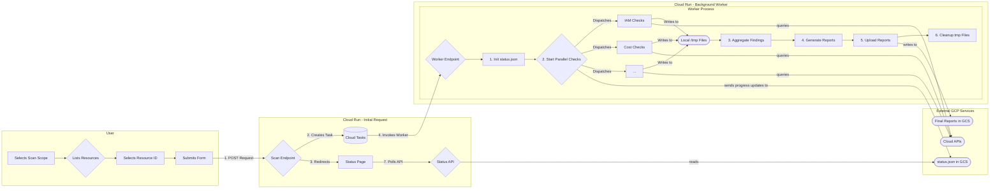

[](LICENSE)

<table>
	<thead>
		<tr>
			<th style="text-align:center"><a href="README.md">English</a></th>
			<th style="text-align:center">日本語</th>
		</tr>
	</thead>
</table>


# **CloudGauge**

注: 本ツールはGoogleが公式にサポートする製品ではありません。このプロジェクトは [Google Open Source Software Vulnerability Rewards Program](https://bughunters.google.com/open-source-security)の対象外です。

CloudGaugeは、Google Cloudの組織（Organization）に対して、コンプライアンス、セキュリティ、コスト最適化、およびベストプラクティスの包括的なチェックを実行するように設計されたWebアプリケーションです。

Python/Flaskで構築され、Google Cloud Run上にサーバーレスアプリケーションとしてデプロイされます。このアプリケーションはCloud Tasksを活用してスキャンを非同期で実行するため、非常に大規模な組織であっても、ブラウザのタイムアウトを発生させることなくスキャン可能です。

最終的な結果は、Google Cloud Storageバケットに保存されるインタラクティブなHTMLレポートおよびCSVファイルとして表示されます。レポートには、Geminiを活用したエグゼクティブサマリーや、gcloudコマンドによる修正案の提案も機能に含まれています。


## **目次**
* [機能](#機能)
* [アーキテクチャ](#アーキテクチャ)
* [デプロイ手順](#デプロイ手順)
  * [共通の前提条件（すべての方法で必須）](#共通の前提条件すべての方法で必須)
  * [方法 1: ソースからデプロイ（推奨）](#方法-1-ソースからデプロイ推奨)
  * [方法 2: gcloudを使用した手動ビルド＆デプロイ](#方法-2-gcloudを使用した手動ビルドデプロイ)
* [使い方](#使い方)
* [トラブルシューティング](#トラブルシューティング)
* [クリーンアップスクリプト](#クリーンアップスクリプト)
* [License & Support](#license--support)

## **機能**

CloudGaugeは、Google Cloud Architecture Frameworkを基に、Organization内のプロジェクトを以下の主要項目を対象にスキャンする仕様です。

### **Security & Identity**

* **組織ポリシー**: ベストプラクティスのリストと照合して、ブール型ポリシーをチェック。
* **組織IAM**: 組織レベルでのパブリックプリンシパル（`allUsers`, `allAuthenticatedUsers`）および基本ロール（`owner`, `orgAdmin`）をスキャン。
* **プロジェクトIAM**: すべてのプロジェクトをスキャンし、基本ロールの`roles/owner`と`roles/editor`が使用されていないかの確認。
* **Security Command Center**: SCC Premiumが有効になっていることを検証。
* **SAキーのローテーション**: 90日以上経過したユーザー管理のサービスアカウントキーを検出。
* **公開GCSバケット**: インターネットに公開されているGCSバケットを検出。
* **オープンなファイアウォールルール**: すべてのVPCをスキャンし、インターネットに開放されているファイアウォールルール（`0.0.0.0/0`）を検出。

### **Cost Optimization**

* **アイドル状態のリソース**: アイドル状態のCloud SQLインスタンス、VM、Persistent Disc、および関連付けられていないIPアドレスを検出。
* **ライトサイジング（適正化）**: 過剰に供与されたVMや、使用率の低いReservationsを特定。
* **コストインサイト**: CPU/メモリ使用率、アイドル状態のイメージなどを詳細にスキャン。

### **Reliability & Resilience**

* **必須連絡先**: `SECURITY`（セキュリティ）、`TECHNICAL`（技術）、`LEGAL`（法務）カテゴリの連絡先が設定されていることを確認。
* **サービスヘルス**: Personalized Service Health （PSH）APIが有効になっていることを検証。
* **Cloud SQLのレジリエンス**: 高可用性（HA）構成、自動バックアップ、ポイントインタイムリカバリ（PITR）をチェック。
* **GCSのバージョニング**: オブジェクトのバージョニングが有効になっていないバケットを検出。
* **GKEの衛生管理**: リリースチャンネルを使用していないクラスタや、自動アップグレードが無効になっているノードプールをチェック。
* **耐久性の検証**: ゾーンMIG（リージョンMIGを推奨）および単一リージョンのディスクスナップショットを特定。

### **Operational Excellence & Observability**

* **監査ログ**: 組織レベルのログシンク（Log Sink）を確認。
* **OS Configの適用状況**: OS Configサービスの対象外となっている実行中のVM（GKE/Dataprocを除く）を特定。
* **モニタリングの適用状況**: 重要なアラートポリシー（例: クォータ、Cloud SQL、GKEなど）が抜け落ちているプロジェクトをスキャン。
* **ネットワークアナライザ**: VPC、GKE、およびPSA（Private Service Access）のIPアドレス使用率に関するインサイトを取り込み、標準化。
* **スタンドアロンVM**: マネージドインスタンスグループ（MIG）によって管理されていないVMを検出。
* **クォータ使用率**: 使用率が80%を超えているリージョンのコンピューティングクォータを特定。
* **放置されたプロジェクト**: 使用率の低いプロジェクトを検出。

## **アーキテクチャ**

このアプリケーションは、綿密で、スケーラブルかつ非同期な「fire-and-forget」パターンを採用しています。これにより、即座に応答を受け取る一方で、負荷の高い作業（数分かかる場合があります）を**バックグラウンドで実行**することができます。

1. **UIトリガー**: ユーザーがCloud RunのURLにアクセスし、組織ID（Organization ID）を送信します。
2. **タスク作成**: `/scan`エンドポイントがスキャン詳細を含む**Cloud Task**を作成し、ユーザーをステータスページにリダイレクトします。
3. **バックグラウンドワーカー**: Cloud Tasksがバックグラウンドで`/run-scan`エンドポイントを安全に呼び出します。
4. **並列処理**: ワーカーはスレッドプールを使用してプロジェクトレベルのスキャンを並行して実行し、数十のチェック処理を行います。
5. **レポート保存**: ワーカーはHTML/CSVレポートを生成し、Google Cloud Storageにアップロードします。
6. **ステータスポーリング**: ユーザーのステータスページは、レポートファイルがGCSで見つかるまでAPIエンドポイントをポーリングし、見つかった時点でダウンロードリンクを表示します。

### **Architecture Diagram**

下図は非同期な "fire-and-forget" パターンを可視化したものになります。



## **デプロイ手順** 

まず**共通の前提条件**に従い、その後に**方法 1** または **方法 2** のどちらかに従いデプロイしてください。

### **共通の前提条件（すべての方法で必須）** 

1. **APIの有効化**:
   * 課金が有効になっているGoogle Cloudプロジェクト。
   * [gcloud CLI](https://cloud.google.com/sdk/install) )がインストールされ、認証されていること（`gcloud auth login`）。
   * 以下のコマンドを実行して、必要なすべてのAPIを有効にします:

   ```
   gcloud services enable \
       run.googleapis.com \
       cloudbuild.googleapis.com \
       cloudtasks.googleapis.com \
       iam.googleapis.com \
       cloudresourcemanager.googleapis.com \
       logging.googleapis.com \
       recommender.googleapis.com \
       securitycenter.googleapis.com \
       servicehealth.googleapis.com \
       essentialcontacts.googleapis.com \
       compute.googleapis.com \
       container.googleapis.com \
       sqladmin.googleapis.com \
       osconfig.googleapis.com \
       monitoring.googleapis.com \
       storage.googleapis.com \
       aiplatform.googleapis.com \
       cloudasset.googleapis.com
   ```
   

2. **サービスアカウントの作成と権限の付与**:
* このサービスアカウント（SA）は、Cloud Runサービスが組織をスキャンし、タスクを作成するために使用されます。
```
   # Set your Organization ID
   export ORG_ID="<your-org-id>"

   

   # Set Project and SA variables

   export PROJECT_ID=$(gcloud config get-value project)
   export SA_NAME="cloudgauge-sa"
   export SA_EMAIL="${SA_NAME}@${PROJECT_ID}.iam.gserviceaccount.com"

   

   # Create the Service Account

   gcloud iam service-accounts create ${SA_NAME} --display-name="CloudGauge Service Account"

   

   #  Grant Permissions 

   

   # 1. Grant ORG-level roles to read assets and policies

   gcloud organizations add-iam-policy-binding ${ORG_ID} --member="serviceAccount:${SA_EMAIL}" --role="roles/browser"

   gcloud organizations add-iam-policy-binding ${ORG_ID} --member="serviceAccount:${SA_EMAIL}" --role="roles/cloudasset.viewer"

   gcloud organizations add-iam-policy-binding ${ORG_ID} --member="serviceAccount:${SA_EMAIL}" --role="roles/compute.networkViewer"

   gcloud organizations add-iam-policy-binding ${ORG_ID} --member="serviceAccount:${SA_EMAIL}" --role="roles/essentialcontacts.viewer"

   gcloud organizations add-iam-policy-binding ${ORG_ID} --member="serviceAccount:${SA_EMAIL}" --role="roles/recommender.iamViewer"

   gcloud organizations add-iam-policy-binding ${ORG_ID} --member="serviceAccount:${SA_EMAIL}" --role="roles/logging.viewer"

   gcloud organizations add-iam-policy-binding ${ORG_ID} --member="serviceAccount:${SA_EMAIL}" --role="roles/monitoring.viewer"

   gcloud organizations add-iam-policy-binding ${ORG_ID} --member="serviceAccount:${SA_EMAIL}" --role="roles/orgpolicy.policyViewer"

   gcloud organizations add-iam-policy-binding ${ORG_ID} --member="serviceAccount:${SA_EMAIL}" --role="roles/resourcemanager.organizationViewer"

   gcloud organizations add-iam-policy-binding ${ORG_ID} --member="serviceAccount:${SA_EMAIL}" --role="roles/servicehealth.viewer"

   gcloud organizations add-iam-policy-binding ${ORG_ID} --member="serviceAccount:${SA_EMAIL}" --role="roles/securitycenter.settingsViewer"

   gcloud organizations add-iam-policy-binding ${ORG_ID} --member="serviceAccount:${SA_EMAIL}" --role="roles/iam.securityReviewer"

   

   

   # 2. Grant PROJECT-level roles (on the project where Cloud Run is deployed)

   gcloud projects add-iam-policy-binding ${PROJECT_ID} --member="serviceAccount:${SA_EMAIL}" --role="roles/aiplatform.user"

   gcloud projects add-iam-policy-binding ${PROJECT_ID} --member="serviceAccount:${SA_EMAIL}" --role="roles/cloudtasks.admin"

   

   # 3. Service Account Token Creator and User role to the SA itself for signed URLs

   gcloud iam service-accounts add-iam-policy-binding ${SA_EMAIL} --member="serviceAccount:${SA_EMAIL}"  --role="roles/iam.serviceAccountTokenCreator" 

   gcloud iam service-accounts add-iam-policy-binding ${SA_EMAIL} --member="serviceAccount:${SA_EMAIL}"  --role="roles/iam.serviceAccountUser"
```
3. **GCSバケットの作成**:
```
export BUCKET_NAME="cloudgauge-reports-${PROJECT_ID}"

gsutil mb -p ${PROJECT_ID} gs://${BUCKET_NAME}

gcloud storage buckets add-iam-policy-binding gs://${BUCKET_NAME} --member="serviceAccount:${SA_EMAIL}" --role="roles/storage.objectAdmin"
```
---

### 

### **方法 1: ソースからデプロイ（推奨）**

### **ステップ 1: GitHubリポジトリをフォーク**

まず、ソースコードのコピーを作成します。

1. Navigate to the [CloudGauge GitHub repository](https://github.com/GoogleCloudPlatform/CloudGauge/).  
2. Click the **Fork** button in the top-right corner of the page.  
3. Choose your GitHub account as the destination for the fork. This will create a copy of the repository under your account (e.g., `https://github.com/your-username/CloudGauge`).

1. [CloudGauge GitHubリポジトリ](https://github.com/GoogleCloudPlatform/CloudGauge/)にアクセス。
2. ページ右上の **Fork** ボタンをクリック。
3. フォーク先として自分のGitHubアカウントを選択。これにより、自分のアカウント下にリポジトリのコピーが作成されます（例: `https://github.com/your-username/CloudGauge`）。


---

### **ステップ 2: Cloud Runサービスを作成**

次に、Cloud Runサービスを作成し、新しいリポジトリに接続します。

1. Google Cloudコンソールで、**Cloud Run**ページを開く。
2. **サービスの作成**をクリック。
3. **Continuously deploy new revisions from a source repository** を選択し、**Set up with Cloud Build**をクリック。
4. 新しいパネルが表示された後、"Repository"の下にある"Source" セクションの**Manage connected repositories**をクリック。  
5. 新しいウィンドウが開き、GitHubに**Google Cloud Buildアプリをインストール**するように求められます。
    * GitHubのユーザー名または組織を選択します。
    * 「Repository access」セクションで、**All repositories**（すべてのリポジトリ）または**Only select repositories**（選択したリポジトリのみ）のいずれかを選択します。後者を選択した場合は、フォークした`CloudGauge`リポジトリを必ず選択してください。
    * **Install**（インストール）または**Save**（保存）をクリックします。
6. Cloudコンソールに戻り、新しく接続したフォーク済みリポジトリとブランチ（`main`）を選択して、**Next**をクリック。
7. **Build Settings** にて以下を設定:
   * **Build Type**: `Dockerfile`を選択 
   * **Source location**: デフォルトの`/Dockerfile`  
   * **Save**をクリック  
8. サービスの詳細を設定します:
   * **Service name**: 例`cloudgauge-service`.  
   * **Region**: リージョンを選択
9. "Container(s), Volumes, Networking, Security"セクションを展開
   * **Identity & Security**タブにて、共通の前提条件のステップ２で作成したサービスアカウントを選択
   * **General**タブにて**Request Timeout**を`3600`秒に設定  
   * **Variables & Secrets**タブにて以下の**Environment Variables**を設定
     * `PROJECT_ID`: ご自身のGCP Project ID (例：`my-gcp-project`)  
     * `TASK_QUEUE`: `cloudgauge-scan-queue`  
     * `RESULTS_BUCKET`: ご自身のGCSバケット名 (例： `cloudgauge-reports-my-gcp-project`)  
     * `SERVICE_ACCOUNT_EMAIL`:サービスアカウントに紐づくemailアドレス
     * `LOCATION`: ステップ9で選択したリージョン (e.g., `asia-south1`)  
10. **Create**をクリック　ー ビルドとデプロイプロセスが開始します。

---

### **ステップ 3: 必要なIAMロールを付与**
サービスアカウントにはCloud Runサービスに対して以下の権限付与が必要です。これの権限付与により、全ての権限が厳密にスコープ化されます（セキュリティのベストプラクティスが遵守されます）。

**Cloud Run 起動元 (roles/run.invoker)**: このロールは、Cloud TasksサービスがCloudGaugeサービスを安全にトリガーしてスキャンを開始できるようにするために必要です。この権限は、デプロイしたばかりの新しいCloud Runサービスに対して付与されます。

**Cloud Run 閲覧者 (roles/run.viewer)**: このロールにより、サービスは起動時に自身のパブリックURLを自動的に検出できます。この機能により、サービスを手動で自身のURLで更新する必要がなくなり、シングルステップでのデプロイが可能になります。この権限はサービスレベルで付与されます。

上記２つのロールを**サービスレベル**で付与することで、サービスアカウントがアクセスする必要のある特定のリソースに対してのみ、**最小限の権限**を持つよう設定可能となります。

**Cloud Shell**または`gcloud`がインストールされたローカルターミナルを開き、プレースホルダーをご実際の値に置き換えて以下のコマンドを実行。

```
# Store your service account email in a variable for convenience  
SA_EMAIL="cloudgauge-sa@your-project-id.iam.gserviceaccount.com"
SERVICE_NAME="your-chosen-service-name"
export REGION="asia-south1" # Or your chosen region

# Grants permission to be invoked by Cloud Tasks
gcloud run services add-iam-policy-binding ${SERVICE_NAME} --member="serviceAccount:${SA_EMAIL}" --role="roles/run.invoker" --region=${REGION}

# Grants permission to view its own service details to find its URL
gcloud run services add-iam-policy-binding ${SERVICE_NAME} --member="serviceAccount:${SA_EMAIL}" --role="roles/run.viewer" --region=${REGION}

```
以上でCloudGaugeの準備が整いました。URLにお進みいただければアプリケーションを利用開始できる状態となっています。

With these permissions set, your CloudGauge instance is fully deployed and ready to use. You can now proceed to the application's URL to start your first scan.

---

### **方法 2: gcloudを使用した手動ビルド＆デプロイ** 

この方法は、ビルドとデプロイの手順を手動で制御する方法となります。

1. **本リポジトリをクローン:**:
```
git clone https://github.com/GoogleCloudPlatform/CloudGauge
cd cloudgauge
```
2. **環境変数を設定する**:  
   * （共通のセットアップで設定したPROJECT_IDとSA_EMAILと置き換えてください）
```
     export REGION="asia-south1" # Or your preferred region  
     export SERVICE_NAME="cloudgauge-service"  
     export BUCKET_NAME="cloudgauge-reports-${PROJECT_ID}"  
     export QUEUE_NAME="cloudgauge-scan-queue"
```   

3. **サービスをビルドしてデプロイ**:
   * このコマンドはコンテナをビルドし、デプロイします。
```
# Build the container image using Cloud Build  
gcloud builds submit . --tag "gcr.io/${PROJECT_ID}/${SERVICE_NAME}" --region=${REGION}

# Deploy to Cloud Run  
gcloud run deploy ${SERVICE_NAME} \
  --image "gcr.io/${PROJECT_ID}/${SERVICE_NAME}" \
  --service-account ${SA_EMAIL} \
  --region ${REGION} \
  --allow-unauthenticated \
  --platform managed \
  --timeout=3600 \
  --memory=1Gi \
  --set-env-vars=PROJECT_ID=${PROJECT_ID},TASK_QUEUE=${QUEUE_NAME},RESULTS_BUCKET=${BUCKET_NAME},SERVICE_ACCOUNT_EMAIL=${SA_EMAIL},LOCATION=${REGION}
```
4. **Invoker & Viewer権限を付与:**:  
   * 立ち上げたサービスのSAに、呼び出し権限を付与します。
```
gcloud run services add-iam-policy-binding ${SERVICE_NAME} \
  --member="serviceAccount:${SA_EMAIL}" \
  --role="roles/run.invoker" \
  --region=${REGION}

gcloud run services add-iam-policy-binding ${SERVICE_NAME} \
  --member="serviceAccount:${SA_EMAIL}" \
  --role="roles/run.viewer" \
  --region=${REGION}
```

以上でサービスのデプロイと設定は完了となります

## **使い方**

1. サービスのURL（`${SERVICE_URL}`）にアクセス。
2. ドロップダウンメニューからスコープ（Scope）を選択: 組織（Organization）、フォルダ（Folder）、またはプロジェクト（Project）。
3. ドロップダウンからリソースを選択。
4. 「Start Scan」（スキャン開始）をクリック。
5. ステータスページにリダイレクトされるので、スキャンが完了するまで待機（組織の規模によっては5〜15分かかる場合があります）。
6. 完了すると、**Interactive HTML Report** と **Download CSV Report**へのリンクが表示されます。

## **トラブルシューティング**

ステータスページが長時間停止したまま動かない場合は、バックグラウンドワーカーが失敗している可能性があるので、以下の方法でトラブルシュートを試みます。

### **ステップ 1: Cloud Runのログを確認**

1. Google Cloudコンソールで**Cloud Run**ページに移動。
2. サービス（`cloudgauge-service`）をクリック。
3. **ログ**タブに移動。
4. `/run-scan` URLへのリクエストに関するログエントリを探す。
5. `/run-scan`のログが見つかったら、赤色のエラーがないか確認。

### **ステップ 2: Cloud Tasksのログを確認**

1. Google Cloudコンソールで**Cloud Tasks**ページに移動。
2. キュー（`cloudgauge-scan-queue`）をクリック。
3. **ログ**タブに移動。
4. タスク試行のステータスを確認（`PERMISSION_DENIED` (HTTP 403) エラーが表示されている場合は、**起動元（Invoker）権限の付与**の手順を見落としていることを意味します）。

### **ステップ 3: 一般的なエラーの解決**

#### **メモリ制限超過 (Memory Limit Exceeded)**

* **エラーメッセージ**: Cloud Runのログに「`Memory limit of 512 MiB exceeded …`」のようなエラーが表示される場合があります。
* **原因**: スキャンプロセスが、Cloud Runサービスに割り当てられているデフォルトのメモリ量を超えて使用しているため。
* **解決策**: サービスに割り当てるメモリを増やす必要があります。
    * **コンソール経由**:
        1. Cloud Runサービスページで**新しいリビジョンの編集とデプロイ**をクリックします。
        2. 「全般」タブで**メモリ割り当て**を見つけ、増やします（例: `2 GiB`へ）。
        3. **デプロイ**をクリックします。
    * **gcloud CLI経由**:
```
gcloud run services update cloudgauge-service \
  --memory=2Gi \
  --region=<your-region>
```
    
---

#### **Google Cloud APIでのアクセス拒否 (Permission Denied on Google Cloud APIs)**

* **エラーメッセージ**: ログに、`storage.googleapis.com`や`iam.googleapis.com`などの特定のGoogle Cloudサービスに関連する`PERMISSION_DENIED`エラーが表示される場合があります。
* **原因**: サービスアカウント（`cloudgauge-sa@...`）に、特定のAPIにアクセスするために必要なIAMロールが不足しているため。
* **解決策**: 通常、エラーメッセージに不足している権限が記載されます。デプロイ手順の**共通の前提条件**セクションに戻り、すべての`gcloud ... add-iam-policy-binding`コマンドが正しいサービスアカウントに対して実行されているか確認してください。不足しているロールについて、コマンドを再実行する必要があります。

---

#### **コンテナの起動失敗 (Container Failed to Start)**

* **エラーメッセージ**: Cloud Runリビジョンが正常な状態にならず、ログに起動直後のエラー（Pythonの`ModuleNotFoundError`や環境変数の欠落に関するエラーなど）が表示される場合があります。
* **原因**: これは通常、以下の2つの理由のいずれかで発生します。
    1. 環境変数が正しく設定されていない。
    2. アプリケーションコードにバグがあるか、`requirements.txt`に依存関係が欠落している。
* **解決策**:
    1. **ログ**タブで、コンテナが起動しようとしたときに発生する特定のエラーメッセージを確認。
    2. エラーが変数に関連している場合は、**Edit & Deploy New Revision**　をクリックし、 **Variables & Secrets**タブに移動して、必要なすべての変数（`PROJECT_ID`、`WORKER_URL`など）が存在し、正しい値が設定されていることを確認。
    3. コードエラーの場合は、ソースコードを修正して新しいリビジョンをデプロイする必要があります。

---

#### **リクエストタイムアウト (Request Timeout)**

* **エラーメッセージ**: ログにHTTP `504`ステータスコード、または「The request has been terminated because it has reached its deadline.（リクエストが期限に達したため終了しました。）」のようなメッセージが表示されます。
* **原因**: スキャンの完了までに、Cloud Runサービスで設定されたリクエストタイムアウトよりも長い時間がかかっています。
* **解決策**: デプロイ手順では、タイムアウトを`3600`秒（1時間）にすることを推奨しています。以下のいずれかの方法をご利用ください。
    * **コンソール経由**: **"Edit & Deploy New Revision"** で、"General"タブの**Request timeout** の値を確認します。
    * **gcloud CLI経由**: 以下を使用して、正しいタイムアウトでサービスを更新できます。

```
gcloud run services update cloudgauge-service \
  --timeout=3600 \
  --region=<your-region>
```
---

#### **VPC Service Controls環境でのビルド失敗**


* **症状**: Cloud Buildを実行すると、外部パッケージの取得が必要なステップ（例: `pip install`、`apt-get update`、`npm install`）でプロセスが失敗します。タイムアウトエラーや、ネットワーク接続や下り（egress）がブロックされていることに関連するメッセージが表示される場合があります。
* **原因**: デフォルトでは、Cloud Buildは組織のVPC Service Controls (VPC SC) 境界の外にあるGoogle管理プロジェクトのワーカー上で実行されます。境界がこれらの外部ワーカーからの下りトラフィックを正しくブロックしているため、依存関係をダウンロードするためのパブリックリポジトリへのアクセスが妨げられています。
* **解決策**: **Cloud Buildプライベートプール**を使用します。これにより、独自のVPCネットワーク*内部*で実行される専用のビルドワーカーがプロビジョニングされ、すべてのビルドトラフィックが内部的なものとなり、セキュリティ境界に準拠するようになります。
  **1. VPC内にプライベートプールを作成する**: まず、VPCネットワークに接続されたプライベートワーカープールを作成します。これにより、すべてのビルドステップが境界内で実行さるようになります。
  
```
gcloud builds worker-pools create [POOL_NAME] \
    --project=[PROJECT_ID] \
    --region=[REGION] \
    --peered-network=projects/[PROJECT_ID]/global/networks/[VPC_NETWORK]
```
  * `[POOL_NAME]`, `[PROJECT_ID]`, `[REGION]`, and `[VPC_NETWORK]` を実際の値に置き換えてください。*  

  **2. プライベートプール用の安全な下り（Egress）ルートを構成**

  VPC SC境界内のプライベートプールは、デフォルトではパブリックパッケージリポジトリにアクセスできません。インターネットへのルートを提供する必要があります。

  **注:** **Cloud NATはこのユースケースでは機能しません** プライベートプールは、Googleが管理する別のVPCに存在し、そのVPCはお客様のVPCとピアリングされています。Cloud NATは、VPCピアリング接続を越えてサービスを提供することはできませんのでご注意ください。

  推奨される解決策は、**専用のCompute Engine VMを安全なNATゲートウェイとして使用する**ことです。

  1. **NATゲートウェイVMを作成する**: VPC内に小さなCompute Engine VMをプロビジョニングします。このVMには外部IPアドレスが必要であり、ネットワークアドレス変換（マスカレード）を実行するように構成する必要があります。スタートアップスクリプトを使用してIP転送を有効にし、必要なiptablesルールを設定できます。
  2. **カスタムルートを作成する**: プライベートプールのIP範囲からのトラフィックをNATゲートウェイVMに向けるカスタムルートを作成する必要があります。これにより、ビルドワーカーのトラフィックのみが外部アクセス用にルーティングされ、他のリソースには影響が及びません。
  3. **ファイアウォールルールを構成する**: 以下のVPCファイアウォールルールを作成します。
      * プライベートプールのIP範囲からNATゲートウェイVMへの**ingress**トラフィックを許可する。
      * NATゲートウェイVMからインターネット（0.0.0.0/0）への**egress**トラフィックを許可する。
   
 **3. プライベートプールを使用してビルドを実行**: `gcloud builds submit`コマンドを変更して、新しく作成したプライベートプールを指定する`--worker-pool`フラグを含めます。
    
```
gcloud builds submit . \
  --tag "gcr.io/[PROJECT_ID]/[SERVICE_NAME]" \
  --region=[REGION] \
  --worker-pool=projects/[PROJECT_ID]/locations/[REGION]/workerPools/[POOL_NAME]
```
このコマンドにより、Cloud Buildは内部プールからのワーカーを使用するようになります。ワーカーのトラフィックは安全なNATゲートウェイVMを経由してルーティングされるため、VPC SC境界に完全に準拠したまま外部の依存関係を取得できます。

---

### **イメージストレージを特定のリージョンに制限**

**症状**: コンテナイメージを特定のGoogle Cloudリージョン（例: 組織のポリシーのリソースロケーション制約のためにasia-south1）に保存する必要があるが、デフォルトではgcr.ioはマルチリージョンのロケーション（us、eu、asia）でイメージをホストしており、特定のリージョン制御を提供していない。

**原因**: Google Container Registry (gcr.io) はマルチリージョンサービスです。イメージの保存場所をきめ細かく制御するには、コンテナイメージと言語パッケージを管理するためのGoogle Cloudの推奨サービスである**Artifact Registry**を使用する必要があります。

**解決策**: Artifact Registryで希望するリージョンにDockerリポジトリを作成し、ビルドコマンドを更新して新しいリージョナルエンドポイントを指すようにします。

**ステップ 1: リージョナルArtifact Registryリポジトリを作成**

まず、選択したリージョンに新しいDocker形式のリポジトリを作成します。この例ではasia-south1（ムンバイ）を使用します。

```
gcloud artifacts repositories create cloudgauge-repo \ 
    --repository-format=docker \
    --location=asia-south1 \
    --description="CloudGauge Docker repository in Mumbai"
```


**ステップ 2: ビルドおよびプッシュコマンドを更新**

次に、ビルドおよびプッシュコマンドのイメージパスを、gcr.io/...から新しいArtifact Registryパスに変更する必要があります： \[REGION\]-docker.pkg.dev/\[PROJECT\_ID\]/\[REPO\_NAME\]/\[IMAGE\_NAME\].

#### **オプション A: Cloud Buildを使用する場合**

Cloud Buildを使用している場合は、gcloud builds submitコマンドの--tagフラグを更新します。

```
gcloud builds submit . --tag "asia-south1-docker.pkg.dev/[PROJECT_ID]/cloudgauge-repo/[SERVICE_NAME]"
```

#### **オプション B: ローカルイメージをプッシュする場合**

イメージをローカルでビルドしている場合は、docker tagおよびdocker pushコマンドを更新します。

\# 1\.イメージをビルドする
```
docker build -t cloudgauge-image .
```
\# 2\. 新しいArtifact Registryリポジトリ用にイメージにタグを付ける
```
docker tag cloudgauge-image asia-south1-docker.pkg.dev/[PROJECT_ID]/cloudgauge-repo/cloudgauge-image
```
\# 3\. イメージをプッシュする
```
docker push asia-south1-docker.pkg.dev/[PROJECT_ID]/cloudgauge-repo/cloudgauge-image
```
これらの手順により、要件を満たす特定のGoogle Cloudリージョンでコンテナイメージが保存および管理されるようになります。

---

## **クリーンアップスクリプト**

以下のgCloudスクリプトは、ツールによって作成されたすべてのリソースを削除します。

### **変数を設定**

以下のスクリプト内のプレースホルダー値をデプロイ時に使用した実際の値に置き換えてください。

```
#!/bin/bash

# --- CONFIGURE THESE VARIABLES ---
export YOUR_ORG_ID="123456789012" # Replace with your Organization ID
export PROJECT_ID="your-gcp-project-id"   # Replace with your Project ID
export REGION="asia-south1"         # Replace with the region you deployed to
# --- END CONFIGURATION ---


# Set derived variables
export SERVICE_NAME="cloudgauge-service"
export QUEUE_NAME="cloudgauge-scan-queue"
export BUCKET_NAME="cloudgauge-reports-${PROJECT_ID}"
export SA_NAME="cloudgauge-sa"
export SA_EMAIL="${SA_NAME}@${PROJECT_ID}.iam.gserviceaccount.com"

# --- DELETION SCRIPT STARTS HERE ---

echo "--- Starting Cleanup for CloudGauge in project ${PROJECT_ID} ---"

# 1. Delete the Cloud Run service
echo "Deleting Cloud Run service: ${SERVICE_NAME}..."
gcloud run services delete ${SERVICE_NAME} --region=${REGION} --platform=managed --quiet

# 2. Delete the Cloud Tasks queue
echo "Deleting Cloud Tasks queue: ${QUEUE_NAME}..."
gcloud tasks queues delete ${QUEUE_NAME} --location=${REGION} --quiet

# 3. Delete the GCS bucket and all its contents
echo "Deleting GCS bucket: gs://${BUCKET_NAME}..."
gsutil -m rm -r "gs://${BUCKET_NAME}"

# 4. Delete the container image from GCR
echo "Deleting container image..."
gcloud container images delete "gcr.io/${PROJECT_ID}/${SERVICE_NAME}" --force-delete-tags --quiet

# 5. Remove all IAM policy bindings for the service account
echo "Removing IAM bindings for ${SA_EMAIL}..."

# Organization-level roles
gcloud organizations remove-iam-policy-binding ${YOUR_ORG_ID} --member="serviceAccount:${SA_EMAIL}" --role="roles/cloudresourcemanager.organizationViewer" --quiet
gcloud organizations remove-iam-policy-binding ${YOUR_ORG_ID} --member="serviceAccount:${SA_EMAIL}" --role="roles/iam.securityReviewer" --quiet
gcloud organizations remove-iam-policy-binding ${YOUR_ORG_ID} --member="serviceAccount:${SA_EMAIL}" --role="roles/recommender.organizationViewer" --quiet
gcloud organizations remove-iam-policy-binding ${YOUR_ORG_ID} --member="serviceAccount:${SA_EMAIL}" --role="roles/cloudasset.viewer" --quiet

# Project-level roles
gcloud projects remove-iam-policy-binding ${PROJECT_ID} --member="serviceAccount:${SA_EMAIL}" --role="roles/cloudtasks.admin" --quiet
gcloud projects remove-iam-policy-binding ${PROJECT_ID} --member="serviceAccount:${SA_EMAIL}" --role="roles/storage.objectAdmin" --quiet
gcloud projects remove-iam-policy-binding ${PROJECT_ID} --member="serviceAccount:${SA_EMAIL}" --role="roles/iam.serviceAccountTokenCreator" --quiet
gcloud projects remove-iam-policy-binding ${PROJECT_ID} --member="serviceAccount:${SA_EMAIL}" --role="roles/aiplatform.user" --quiet
gcloud projects remove-iam-policy-binding ${PROJECT_ID} --member="serviceAccount:${SA_EMAIL}" --role="roles/run.invoker" --quiet # This was added to the SA itself, but good to be explicit

# 6. Delete the Service Account
echo "Deleting service account: ${SA_EMAIL}..."
gcloud iam service-accounts delete ${SA_EMAIL} --quiet

echo "✅ Cleanup complete!"
```
---

### **削除スクリプトの解説**

1. **Cloud Runサービスの削除**: `gcloud run services delete`  
   * これにより、メインのWebアプリケーション自体が削除され、実行が停止してコストが発生しなくなります。
2. **Cloud Tasksキューの削除**: `gcloud tasks queues delete`
   * 自動的に作成されたcloudgauge-scan-queueという名前のCloud Tasksキューを削除します。
3. **GCSバケットの削除**: `gsutil -m rm -r`  
   *　cloudgauge-reports-...バケットと、その中に保存されているすべてのHTML/CSVレポートを削除します。-mフラグは、多数のレポートファイルがある場合に高速に実行します。
4. **コンテナイメージの削除**: `gcloud container images delete`  
   * サービスをデプロイ時にCloud Buildはコンテナイメージを作成し、Google Container Registry (GCR) に保存したものを削除します。
5. **IAMバインディングの削除**: `gcloud ... remove-iam-policy-binding`  
   *　サービスアカウントを削除する前に、組織レベルとプロジェクトレベルの両方で付与したすべての権限（ロール）を削除する必要があります。これにより、ゴーストプリンシパルがIAMポリシーに表示されるのを防止します。
6. **サービスアカウントの削除**: `gcloud iam service-accounts delete`  
   * 権限を削除した後、`cloudgauge-sa`サービスアカウントを安全に削除します。


## **License & Support** 

This is not an officially supported Google product. This project is not eligible for the [Google Open Source Software Vulnerability Rewards Program](https://bughunters.google.com/open-source-security).

This project is licensed under the Apache 2.0 License. See the `LICENSE` file for details.

For issues or feature requests, please file an issue on the project's GitHub page.
